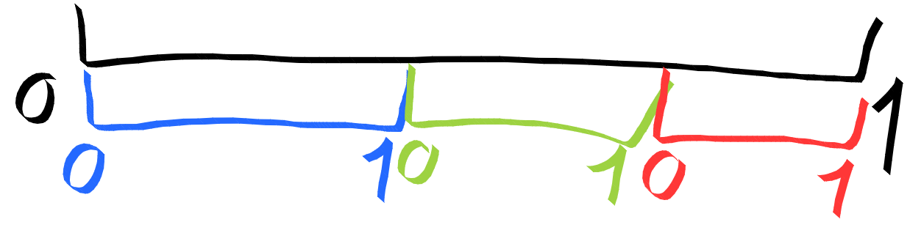
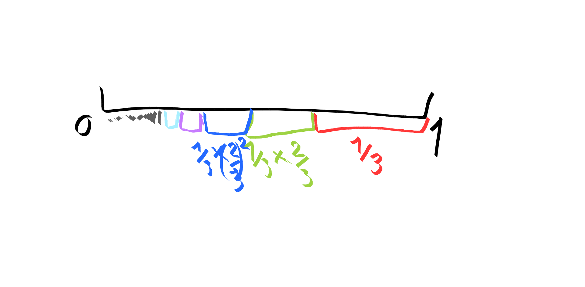

## Driver

Here is the code running on arduinos that actualy drive the lights.

## Composition

A `Composition` is what determines how each LED of a ribbon gets mapped to a color in a `ColorPalette`. It is made of a `Mask`, a `Slicer` and a `PaletteRangeController`.

### PaletteRangeController

The whole palette is not necessarily displayed at once ; the section of the palette that is displayed is controlled by the `PaletteRangeController`. This section is determined by a `center` and a `width`. The position of the `center` evolves over time and is controlled by an `Oscillator` which can be a `Sine`, `SawTooth` etc.

### Slicer

The entier ribbon will not necessarily be considered as one unit, with spatial coordinates going from 0 to 1. It can be split up in slices, each one having its own local coordinates ranging from 0 to 1.

If `flip_every_other_slice` is `true`, every other slice will have its coordinates going in the other direction.

If you are not using uneven slices, you will have `slices_count` slices of equal size.

If you are using uneven slices, you will have an infinite number of slices, each one `uneven_slices_factor` times smaller than the previous one. (NB : `uneven_slices_factor` is a `uint8_t` but it represents a fraction between 0 and 1 and is used as such in the code). If `uneven_slices_factor` is 255, each slice will be infinitely thin (conceptually). If it is 0, there will only be one slice taking up the whole ribbon.
Example with `uneven_slices_factor = 2/3` ; each slice is two `2/3` smaller than the previous one.

In order for the sum of lengths to be 1, the first one has to have a size of `1 - 2/3 = 1/3`. (Because $\sum\limits_{n = 0}^{+\infty}(1-f)f^n = (1-f)\sum\limits_{n = 0}^{+\infty}f^n = (1-f) \frac{1}{1-f} = 1$).

We could also use a finite number of slices, it would just give slightly more complicated calculations to the computer to do.

#### Uneven slices: Implementation details

Given a position `pos_in_ribbon`, we care about the two bounds of the slice where this position is. We first convert this position into a relative position: `const uint8_t p = map_32_to_8(pos_in_ribbon, ribbon_size);`. Then we start with the bounds of the right-most slice, and if `p` is not in that slice, we check the next slice. The n-th separator is positionned at $f^n$ (where `f = uneven_slices_factor`) because the first separator (the right-most one) is $1 (=f^0)$, and the size of the n-th slice will be $f^{n-1}-f^n = f^{n-1}(1 - f)$ which is exactly what we want as explained previously with the last drawing.

Once we have found the slice that we are in, we just linearly interpolate `p` between the bounds of the slice to remap it between 0 and 255. 

### Mask

Not all LEDs of each slice are necessarily lit up at once. This is controlled by the `Mask`. It has a `center` and a `half_width` and only the LEDs that are in the range [`center - half_width`, `center + half_width`] are lit up. Note that `center` and `half_width` are relative ; they represent a fraction between 0 and 1 (stored as a `uint8_t`). This means that if `half_width == 63` half of the LEDs of the slice will be lit, no matter the actual size in pixels of the slice.

You also have `should_wrap` which controls whether the range should behave as a circle and wrap when one end overflows 0 or 255, or if should be a segment and clamp when it overflows.

